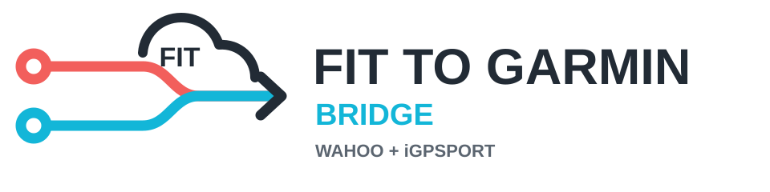

<p align="center">
  
</p>

<p align="center">
  Automatically sync Wahoo/ELEMNT and iGPSPORT activities into Garmin Connect.
</p>

<p align="center">
  <a href="https://ghcr.io/ntrance/wahoo-garmin-fit-bridge"></a>
  <a href="https://github.com/ntrance/wahoo-garmin-fit-bridge/actions/workflows/quality.yml"></a>
  <a href="https://github.com/ntrance/wahoo-garmin-fit-bridge/releases"></a>
  <a href="LICENSE"></a>
  <a href="https://ko-fi.com/ntr4nce"></a>
</p>

FIT to Garmin Bridge is a self-hosted Docker service for people who record rides
outside the Garmin ecosystem but still want those activities in Garmin Connect.
It watches your enabled sources, downloads each original FIT file, applies the
identity of a Garmin device you own, prevents duplicate imports, and uploads the
result automatically.

Supported sources:

| Source | Automatic sync | How activities are obtained |
| --- | --- | --- |
| Wahoo / ELEMNT | Yes | Wahoo shares activities to Dropbox |
| iGPSPORT | Yes | The bridge polls your iGPSPORT Cloud account |

Enable either source or both. They run independently and feed the same protected
processing pipeline.

[](https://ko-fi.com/ntr4nce)

> [!IMPORTANT]
> This is an unofficial community project. It is not affiliated with or supported
> by Wahoo, iGPSPORT, Garmin, or Dropbox. Garmin Connect and iGPSPORT Cloud do not
> provide supported public APIs for this workflow, so upstream changes may
> temporarily interrupt syncing.

## Features

- **Garmin Edge 1040 Head Unit Emulation**: Default 1-click emulation of a Garmin Edge 1040 bike computer (`3991`) with a distinct emulated serial number (`3991000001`), ensuring Garmin Connect automatically syncs your Wahoo/iGPSPORT rides down to your **Fenix**, **Forerunner**, or **Venu** watch via **Physio TrueUp**.
- **Pre-Built Disk SVG Route Previews**: Route SVGs and activity summary metrics are pre-calculated on activity import and persisted under `/data/previews/{activity_id}.json`, delivering **0.05ms** detail page rendering with zero FIT decoding overhead.
- **Automatic Host Timezone Detection**: Automatically detects the host system timezone (`Europe/London` default) with full alias normalization (`Etc/lon`, `london`, `uk`, `gb`, `bst`) and live updates in `/config` without container rebuilds.
- **Smart Time-Window Polling**: Automatically adjusts poll intervals based on local time of day (overnight quiet window 00:00–06:00, daylight hourly polling, and 15-minute peak evening ride window 17:00–22:00 evaluated in your local timezone).
- **Streamlined Configuration Interface**: Simple, 1-click configuration form for Garmin account and head unit setup, with advanced raw ID inputs neatly collapsed.
- Automatically polls Wahoo/Dropbox and iGPSPORT Cloud at separate intervals.
- Allows Wahoo and iGPSPORT to run together in one container.
- Uses original FIT activity data and rewrites device metadata with the Garmin FIT SDK.
- Reuses encrypted transport and persisted Garmin/iGPSPORT sessions.
- Handles cloud rate limits with bounded retries and exponential backoff.
- Prevents repeat uploads using source IDs, remote metadata, SHA256, FIT start
  time, filename, size, stored history, and Garmin duplicate responses.
- Starts in dry-run mode and provides bounded historical iGPSPORT imports.
- Includes a password-protected dashboard, activity details, route preview,
  charts, logs, retries, reprocessing, and cleanup controls.
- Stores configuration and activity history in persistent Docker volumes.

## How It Works

```text
Wahoo / ELEMNT  --> Dropbox ----\
                                  \
                                   FIT to Garmin Bridge
                                  /        |
iGPSPORT device --> Cloud -------/         |
                                            v
                          deduplicate -> rewrite (Edge 1040) -> upload
                                            |
                                            v
                                      Garmin Connect
                                            |
                                            v (Physio TrueUp)
                                    Fenix / Forerunner Watch
```

Normal polling does not delete remote activities. Dropbox deletion only occurs
after an explicit administrator action. iGPSPORT remote deletion is not supported.

## Requirements

- A Docker host with Docker Compose
- A Wahoo/ELEMNT device with Dropbox sharing, an iGPSPORT Cloud account, or both
- A Garmin Connect account

FIT files can contain device identifiers, timestamps, and location history. Treat
them as private data and never commit them to Git.

## Quick Start

```bash
git clone https://github.com/ntrance/wahoo-garmin-fit-bridge.git
cd wahoo-garmin-fit-bridge
cp .env.example .env
```

Set at least:

```dotenv
WEB_USERNAME=admin
WEB_PASSWORD=replace-with-a-strong-password
SESSION_SECRET_KEY=replace-with-a-separate-long-random-value
DRY_RUN=true
```

Generate the session secret with:

```bash
openssl rand -hex 32
```

Start the bridge:

```bash
docker compose up -d --build
```

Compose first runs a one-shot permission initializer for `/data` and `/appdata`,
then starts the bridge as the unprivileged `bridge` user. Garmin and source
accounts can be configured in either order and do not require restarts between
them.

Never use `chmod -R 777` on these directories. They contain account credentials,
session tokens, FIT location history, and the activity database. Current releases
automatically repair existing volume ownership and restrict directories to the
container user during startup.

The Config page stores runtime choices such as dry-run mode, enabled sources, timezone, and
polling intervals in `/appdata/runtime.env`. Those saved values override matching
defaults in `.env`; change them through Config after initial setup. Deployment
settings such as `TZ` are auto-detected or updated directly in `/config` without needing container rebuilds.

Open `http://localhost:8088`, sign in, and keep dry-run mode enabled until the
source and Garmin sections all report that setup is complete.

## Configure Wahoo and Dropbox

First enable Dropbox activity sharing in the Wahoo app using the
[Wahoo Authorized Apps guide](https://support.wahoofitness.com/hc/en-us/articles/14467471126802-Authorized-Apps-Wahoo-app).

Then open **Config > Dropbox**:

1. Select **Start Dropbox Setup**.
2. Approve access in Dropbox.
3. Dropbox redirects to a `localhost:53682` address. The page may not load; copy
   the complete address from the browser bar.
4. Paste it into **Returned localhost URL** and finish setup.
5. Select **Test Dropbox**.
6. Enable **Wahoo / Dropbox** under **Connection Settings**.

The rclone configuration is stored in the persistent `/appdata` volume. New
Wahoo activities shared to Dropbox are then imported automatically.

## Configure iGPSPORT

Open **Config > Connection Settings**, enable **iGPSPORT Cloud**, and save. Then
open **Config > iGPSPORT Cloud**:

1. Enter the iGPSPORT account identifier and password.
2. Select the correct account region.
3. Keep **Only activities recorded after enabling iGPSPORT** for the first sync.
4. Save the profile and select **Test iGPSPORT login**.
5. Select **Sync now**.

New iGPSPORT activities are polled automatically every 15 minutes by default.
The source reuses its saved session, stops when it reaches a known activity,
downloads only unknown FIT files, and backs off after API or rate-limit failures.

Credentials are stored only in owner-readable files under `/appdata/igpsport`.
They are not written to SQLite, logs, runtime settings, or rendered HTML. Leaving
the password field blank preserves the existing saved password.

### Historical iGPSPORT Activities

Historical imports never run automatically. In **Config > iGPSPORT Cloud**, choose
a start date, optional end date, maximum count, and dry-run or upload mode. Review
the confirmation page and enter `IMPORT`.

Imports are capped at 500 activities and retain all global duplicate checks.
Start with a small dry-run batch.

## Use Both Sources

Wahoo/Dropbox and iGPSPORT can remain enabled together. Each source has its own
poll schedule, session, source ID, and error state, while sharing one deduplication
and Garmin upload pipeline.

Do not run a second development container against the same live source accounts.
Two containers polling the same accounts have separate SQLite histories and can
race each other before either records the upload.

## Configure Garmin & Head Unit Emulation

Open **Config > Garmin Upload**:

1. Enter your Garmin Connect email and password.
2. **Emulated Device Target** defaults to **⭐ Garmin Edge 1040 (PREFERRED - Enables Watch Physio TrueUp Sync)** out of the box.
3. Select **Save Garmin Setup**.
4. Create or verify the Garmin session.

The profile is stored at `/appdata/garmin/profile.json`; session tokens are stored
under `/appdata/garmin/tokens`. Both are private persistent data.

### Why Emulate a Garmin Edge 1040?

Garmin Connect evaluates uploaded `.fit` binary headers (`file_id.manufacturer` and `file_id.serial_number`):
- If a `.fit` file contains **your watch's serial number**, Garmin Connect assumes *"The watch recorded this ride directly and already has it in local flash storage,"* suppressing Physio TrueUp sync.
- Emulating a **Garmin Edge 1040** bike computer with a distinct fake serial number (`3991000001`) causes Garmin Connect to treat the ride as recorded on a separate head unit. Garmin Connect then automatically pushes the activity down to your **Fenix**, **Forerunner**, or **Venu** watch via **Physio TrueUp** during your next Bluetooth/Wi-Fi sync!

For users who own a physical Garmin device and want activities to match its exact hardware identifiers, expand **Advanced Device Customization** in `/config` to upload a genuine `.fit` file or edit raw device IDs manually.

### Sync Uploaded Activities to Your Garmin Device

[Physio TrueUp](https://support.garmin.com/en-IN/?faq=g4zagaDmtJ0luYPPvEuwz9)
must be active for Garmin Connect to sync supported fitness and training data
back to a compatible Garmin device. Garmin devices that support Unified Training
Status have Physio TrueUp enabled automatically. On other compatible devices,
enable it in Garmin Connect under the device's **General**, **Device Settings**,
**My Stats**, or **System** settings.

After the bridge uploads an activity, sync your Garmin device with Garmin Connect over Bluetooth or Wi-Fi.
The activity will sync down to your watch history, Training Load, VO2 Max, Recovery Time, and Load Focus.

## Enable Uploads

While dry-run mode is enabled, sync each source and confirm:

- Activity dates and distances are correct.
- The expected source is shown.
- The intended Garmin device is selected.
- No unexpected duplicates appear.

When the checks look correct, open **Config > Connection Settings**, switch
**Dry-run mode** off, and select **Save Settings**. The change applies
immediately to future manual syncs and background polling; the container does
not need to be rebuilt or restarted.

`DRY_RUN` in `.env` supplies the initial default for a new installation. After
settings have been saved in the web interface, the persistent
`/appdata/runtime.env` value takes precedence. Use the Config page for later
changes.

Dry-run records are not automatically uploaded later. Reprocess an older activity
only after confirming it is not already present in Garmin Connect.

## Normal Operation

After setup, no routine Config changes are required. Enabled sources are polled
automatically and newly downloaded activities are uploaded to Garmin Connect.
The Dashboard sync button can request an immediate check but is not required for
normal operation. Saved Garmin and iGPSPORT sessions are reused and refreshed by
their client libraries where supported. Return to Config only when credentials
change, an authentication error requests attention, or you want to change sources,
dry-run mode, or polling intervals.

## Duplicate Protection

The bridge checks source activity IDs, remote metadata, FIT SHA256, activity
start time, filename and size, stored history, and Garmin conflict responses.
Known source items are skipped before downloading where possible.

No duplicate system can identify every manually edited or re-exported activity.
Use dry-run mode when connecting an existing account or importing history.

## Persistent Data

Both paths must survive container replacement:

| Container path | Contents |
| --- | --- |
| `/data` | Incoming, processing, uploaded, duplicate, failed, and archived FIT files |
| `/appdata` | SQLite history, settings, source credentials, sessions, Garmin profile, and logs |

Always mount persistent Docker volumes at both paths. Losing `/appdata` removes
deduplication history and authentication state. Back up both volumes before
upgrades. Backups contain credentials, tokens, device IDs, and location history,
so encrypt them and keep them outside the repository.

## Security

The web interface includes signed HttpOnly cookies, CSRF protection, login rate
limiting, security headers, bounded uploads, private credential files, and output
redaction. The container runs as an unprivileged user with a read-only root
filesystem, dropped Linux capabilities, and `no-new-privileges`. A one-shot
initializer receives only the ownership-related capabilities needed to secure the
persistent volumes, has no network access, and exits before the bridge starts.

For stronger password storage:

```bash
docker compose run --rm bridge wahoo-bridge-hash-password
```

Set `WEB_PASSWORD_HASH`, leave `WEB_PASSWORD` empty, terminate HTTPS at a trusted
reverse proxy, and do not expose port `8088` directly to the public internet.

Never commit `.env`, `/data`, `/appdata`, databases, logs, credentials, tokens,
real FIT files, or Garmin unit IDs. See [SECURITY.md](SECURITY.md) for reporting
instructions.

Every push and pull request runs tests, Ruff, Bandit, `pip-audit`, a Docker build,
Trivy image scanning, and Trivy deployment configuration scanning.

## Releases and Container Images

[GitHub Releases](https://github.com/ntrance/wahoo-garmin-fit-bridge/releases)
are the clearest place for users to see stable versions, release notes, and
upgrade information.

Each version tag also publishes a ready-to-run Linux AMD64 image to GitHub
Container Registry:

```bash
docker pull ghcr.io/ntrance/wahoo-garmin-fit-bridge:latest
```

Use a fixed version tag in production instead of `latest` so upgrades are
intentional. The source repository remains the canonical installation option;
the package is a convenience for hosts that prefer prebuilt images.

## Deployment

Use `docker-compose.yml` on a normal Docker host. For Dokploy, use
`docker-compose.dokploy.yml`, mount persistent volumes at `/data` and `/appdata`
before the first production deployment, and provide secrets through Dokploy's
environment settings.

## Limitations

- Intended for personal, self-hosted use.
- Historical Wahoo activities are not automatically backfilled by Wahoo.
- Garmin and iGPSPORT may change their private authentication or upload endpoints.
- Garmin decides how imported device information is displayed and whether an
  activity qualifies for a badge or challenge.
- Uploading an activity to Garmin Connect does not guarantee that Garmin will
  download it to a watch or recalculate device-side Recovery Time, Acute Load,
  Training Effect, or activity history. Do not copy rewritten FIT files directly
  into a Garmin device; that workflow is unsupported and can create duplicates.
- A malformed FIT file may require a fresh export from the original source.

## Syncing Historical Wahoo Activities

Automatic Wahoo sharing to Dropbox syncs newly recorded rides after sharing is configured in the ELEMNT companion app. To upload past or historical rides recorded prior to enabling automatic sharing:

1. Connect your Wahoo ELEMNT device to your computer via USB (or access its internal storage).
2. Locate the `.fit` files in the device storage directory (e.g., `exports` or `exports/fit`).
3. Copy the historical `.fit` files directly into your connected Dropbox folder (`Apps/WahooFitness`).
4. The bridge will automatically discover, deduplicate, rewrite, and upload your historical rides to Garmin Connect during the next sync cycle.

## Performance & Hardware Optimization

The bridge features auto-detecting hardware profiles and optimized SQLite write handling for running efficiently on low-resource devices (Raspberry Pi 3, Pi 4, Pi 5, or low-cost VPS instances):

- **SQLite WAL & Normal Synchronization**: Configured with `PRAGMA synchronous = NORMAL` and in-memory temporary storage to minimize random SD card/flash disk writes and prevent I/O bottlenecks.
- **LRU Preview Caching**: Route SVGs and activity previews are cached after initial generation, reducing repeated preview load times from **~2,400ms to 0ms**.
- **Smart Time-Window Polling**: Automatically adjusts poll intervals based on time of day (overnight quiet window 00:00–06:00, daylight hourly polling, and 15-minute polling during peak evening ride hours 17:00–22:00).
- **Hardware Profile Auto-Detection**: Automatically tunes background thread pool concurrency based on available system memory (`HARDWARE_PROFILE=low|balanced|high`).

## Development

```bash
python -m pip install -e ".[dev]"
pytest -q
ruff check .
```

Contributions must not include real FIT activities, credentials, session tokens,
unit IDs, deployment addresses, or other personal data.

## Support

If this bridge saves you time, you can support development on
[Ko-fi](https://ko-fi.com/ntr4nce).

## License and Acknowledgements

This bridge is released under the [MIT License](LICENSE). It uses the
[Garmin FIT SDK](https://developer.garmin.com/fit/overview/),
[garminconnect](https://github.com/cyberjunky/python-garminconnect), and
[rclone](https://rclone.org/). See [THIRD_PARTY_NOTICES.md](THIRD_PARTY_NOTICES.md).

Wahoo, ELEMNT, iGPSPORT, Garmin, Garmin Connect, Dropbox, and their respective
marks are the property of their owners.
